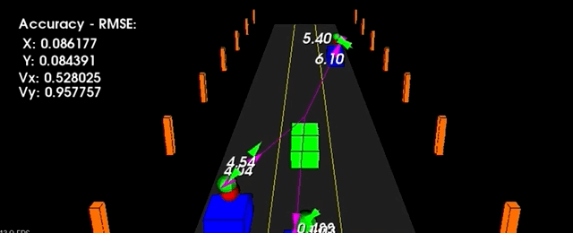
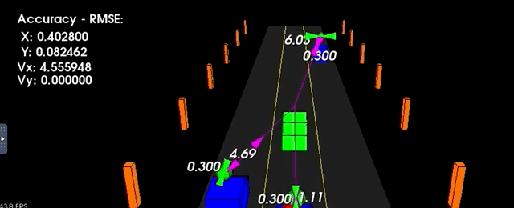
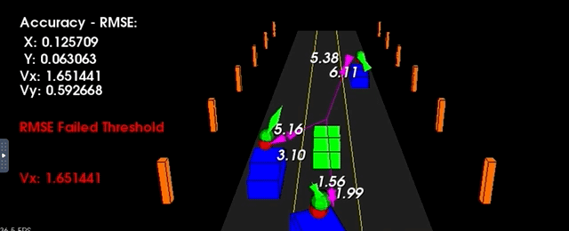

# SFND_Unscented_Kalman_Filter
Sensor Fusion UKF Highway Project Result

## Meaning of colors and shape

 - Green Car : Ego Vehicle
 - Blue Car : Ground Truth of Target Vehicle
 - Red Sphere : Lidar Sensing Data (px, py)
 - Purple Line/Arrow : Radar Sensing Data (range, angle, doppler)
 - Green Sphere/Arrow : UKF Result (px, py, v, yaw, yaw_rate)

---

## Dependencies
* cmake >= 3.5
* make >= 4.1
* gcc/g++ >= 5.4
* PCL 1.2
* Or Use my docker [image](https://hub.docker.com/r/kimjw7981/sfnd) : `docker run -p 6080:80 -v /dev/shm:/dev/shm kimjw7981/sfnd`

## Basic Build Instructions

1. Clone this repo.
2. Make a build directory: `mkdir build && cd build`
3. Compile: `cmake .. && make`
4. Run it: `./ukf_highway`

## Step By Step
1. Turn Off all sensors\
  \
  RMSE Fail: X, Y, Vx, Vy\
  Reason: No sensing data and keep initial values
  
2. Predict and use only LiDAR data (KF) for updating with measurement\
  \
  RMSE Fail: Vx\
  Reason: LiDAR can detect position directly and isn't used for calculating velocity

3. Predict and use only Radar data (UKF) for updating with measurement\
  \
  RMSE Fail: Y, Vy\
  Reason: Radar can detect position and velocity with low resolution.

4. Predict and use Sensor Fusion data with LiDAR (KF) and Radar (UKF) for updating with measurement\
  \
  RMSE Fail: None\
  Reason: Sensor Fusion data makes better result (Reduce each other's errors)
